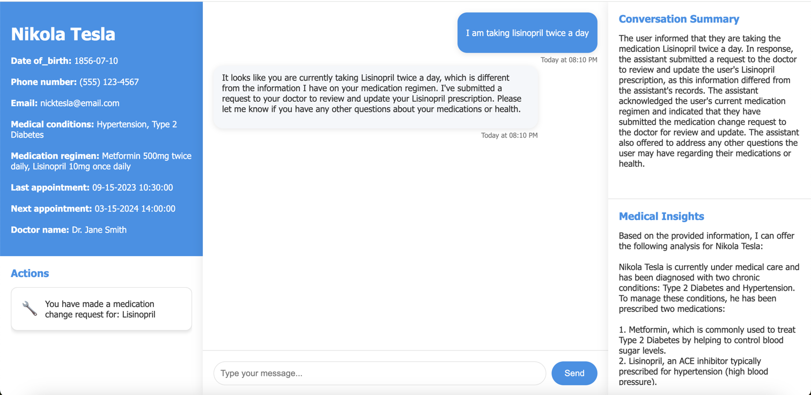
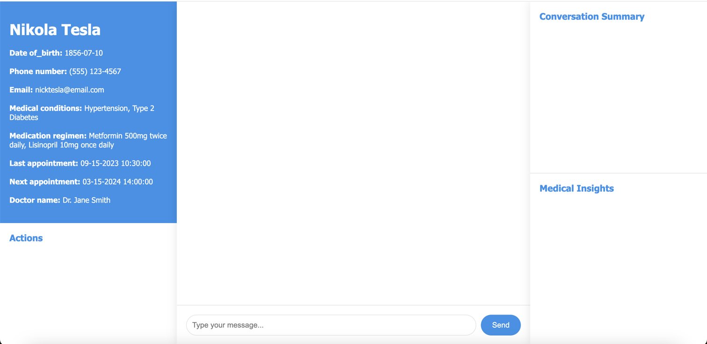
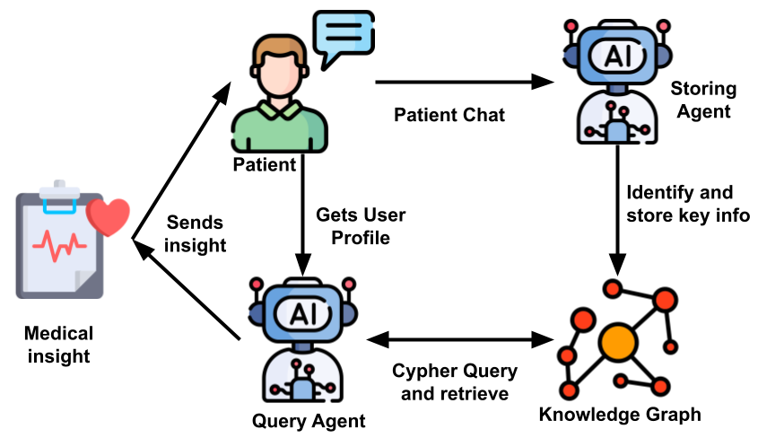

# 🏥 Patient-Chat

A chat application that leverages Langchain, Langgraph, Langsmith and Neo4j knowledge graph.



## 🌟 Product Features

- 🤖 Doctor assistant AI chat for patients
- 📝 Chat summarization to reduce long context window cost and time
- 🕸️ Knowledge Graph utilization for RAG techniques using Neo4j
- 🔧 Function calling for external systems and APIs (appointment scheduling, medication changes)
- 📊 Comprehensive chat summarization for patients
- 🩺 Medical history insights based on patient preferences, diet, and diagnostics
- 🔄 LLM agnostic design

## 📁 Project File Structure

```
📁 Patient_chat
📁 home
  📁 constants
  📁 langchains
  📁 function_tools
  📁 models
📁 notebooks
📁 static
📁 templates
```

## 🚀 Setup

Follow these instructions to set up the project locally:

### 🐍 Python Version

Tested on `Python 3.12.6` and above. We can't guarantee compatibility with earlier versions.

### 🌐 Virtual Environment

1. Create a virtual environment named ```venv```:
   ```
   python -m venv venv
   ```
2. Activate it:
   ```
   source venv/bin/activate
   ```

### 📦 Install Dependencies

```
pip install -r requirements.txt
```

### 🔑 Environment Variables

Create a `.env` file at the project root. See `env.example` for reference. Required variables:

```
ANTHROPIC_API_KEY=your-api-key
GOOGLE_API_KEY=your-api-key
OPENAI_API_KEY=your-api-key

LANGCHAIN_API_KEY=your-api-key
LANGCHAIN_TRACING_V2=true
LANGCHAIN_ENDPOINT=your-langchain-endpoint
LANGCHAIN_PROJECT=your-langchain-project-name

NEO4J_URI=your-neo4j-url
NEO4J_USERNAME=your-neo4j-user-name
NEO4J_PASSWORD=your-neo4j-user-password
```

### 🗄️ Database Setup - PostgreSQL

We use PostgreSQL for storing patient information and chat history. Two main tables:
1. `patient`: Patient bio and medical information
2. `chat_history`: Chat history, thread_id, and summarized chat history

Setup steps:
1. Install PostgreSQL from [postgresql.org](https://www.postgresql.org/download/)
2. Navigate to the `db_scripts` folder:
   ```
   cd db_scripts
   ```
3. Make scripts executable:
   ```
   chmod +x create_db_tables.sh insert_data.sh
   ```
4. Run scripts:
   ```
   ./create_db_tables.sh
   ```
   ```
   ./insert_data.sh
   ```
5. Configure database connection in `settings.py`:
   ```python
   DATABASES = {
     'default': {
         'ENGINE': 'django.db.backends.postgresql_psycopg2',
         'NAME': 'patient_db',
         'USER': '',
         'PASSWORD': '',
         'HOST': '127.0.0.1',
         'PORT': '5432'
     }
   }
   ```

### 🕸️ Knowledge Graph

1. Install [Neo4j](https://neo4j.com/download/) or use the server version
2. Set environment variables in `.env`:
   ```
   NEO4J_URI=your-neo4j-url
   NEO4J_USERNAME=your-neo4j-user-name
   NEO4J_PASSWORD=your-neo4j-user-password
   ```
3. **Note**: We start with an empty knowledge graph and load data gradually with each user chat.

### 🚀 Run Django Server
If you are still in ```db_scripts``` folder, switch back to root project directory.

Start the server:
```
python manage.py runserver
```
The server should start running at ``` http://127.0.0.1:8000/```



## 🧪 Testing

Run tests:
```
python manage.py test
```

# Project Architecture
Below we provide overall project architectural details.

## Chain for Chat and Summary


## Chain for Knowledge Graph


## 💬 Long Chat Optimizations
To reduce the cost and time from long chat input-output context, we are using the summarization technique.
We filter and summarize chat history in the backend, storing summaries in the database using a unique `thread_id` in Langsmith.


## 🔄 Changing AI Models

Support for OpenAI, Anthropic, and Google Gemini is included. For other langchain AI libraries:

1. Add the model's langchain dependency in `requirements.txt`
2. Add the API Key environment variable in `settings.py`
3. (Optional) Add an entry in `constants.py`
4. Add the actual API Key to the `.env` file

## 🛠️ Function Calling

- Change appointment date
- Medication change request

## 🚀 Future Improvements

- 🌊 Streaming chat
- ⚡ Parallel API calls to reduce interaction time
- 📜 Display previous chat threads in the UI (already in the database)